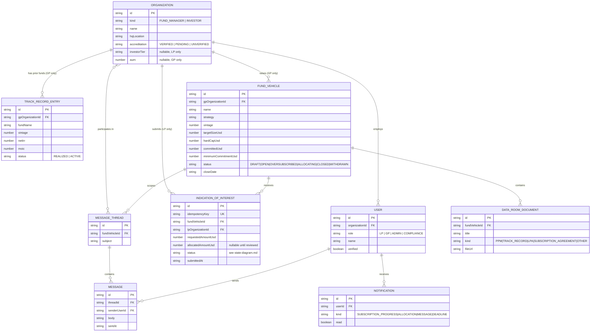

# Data Model — Entity Relationship Diagram

Source of truth for these shapes is [`src/types/entities.ts`](../../src/types/entities.ts)
— this diagram is generated from that file, not the other way round, so the two never
drift apart during the build.

## Notes on the shape of this model

- **`IndicationOfInterest.idempotencyKey` is unique, not `id`.** The client generates it
  once per submission attempt; `submitIndication` (see `src/mock/api.ts`) looks it up
  before creating anything, so a network retry after a dropped response can never create
  a duplicate indication. This is the concrete mechanism behind the brief's "concurrent
  bids and race conditions" requirement.
- **`FundVehicle.committedUsd` is a running total owned by the server**, not derived
  client-side from summing indications — the frontend never computes subscription
  percentage from its own cache, it always reads the authoritative field. See
  `state-diagram.md` for why this matters under concurrent submissions.
- **`MessageThread` is scoped to a `FundVehicle`, not a pair of users.** Diligence
  conversations belong to the deal, not the individuals — this also makes it trivial to
  hand a thread to a colleague at either org without losing context, and gives Compliance
  a single place to review all communication about a given raise.
- **`TrackRecordEntry` belongs to the `Organization` (GP firm), not a `FundVehicle`.** A
  firm's prior funds are evidence for *every* current raise, not just one — track record
  is a firm-level trust signal, and the UI reads it off the GP's org profile.
