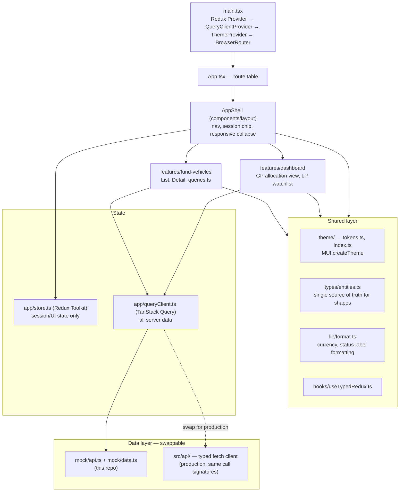

# Frontend Architecture

This one *is* the prototype — the diagram matches `src/` directly, not an aspirational
future structure.

## The one architectural decision worth defending in the room

**Redux Toolkit for client/session state, TanStack Query for server state — deliberately
not one library doing both jobs.** `app/store.ts` never caches anything the API returned;
`queries.ts` never holds UI-only state (like which nav item is open). The dividing line is
mechanical, not a matter of taste: *if it came from `fetch`, it lives in Query; if it's
purely client-side (current viewer role, an open drawer), it lives in Redux.* This is
also exactly why swapping `mock/api.ts` for a real fetch client at `src/api/` on go-live
touches zero Redux code — the two state layers don't know about each other.

**Feature folders own their query hooks.** `fund-vehicles/queries.ts` is the only place
that knows the shape of a fund-vehicle API call; `FundVehicleListPage.tsx` and
`FundVehicleDetailPage.tsx` just call `useFundVehicles()` / `useFundVehicle(id)`. Adding a
new feature (e.g. messaging in Phase 3) means adding a new folder with its own
`queries.ts`, not touching a shared "api hooks" file that every feature fights over.

**Design tokens are a separate file from the MUI theme (`tokens.ts` vs `index.ts`).**
Anything that needs a raw color value outside MUI's `sx`/`palette` system (a chip
background computed from a non-standard palette key, a chart color in Recharts) imports
the token, not the theme — MUI's theme object is for MUI components, the token file is
the actual source of truth, documented with contrast ratios in `DESIGN.md`.
