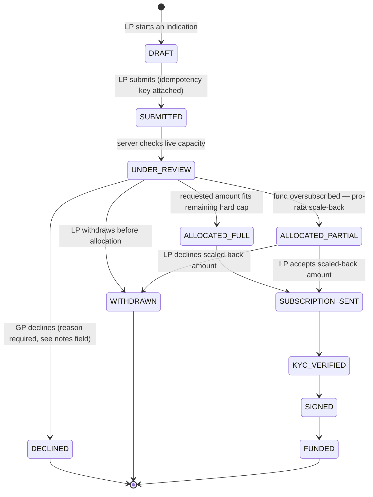

# Indication of Interest — State Diagram

Rendered, Greenstone-branded version: [`state-diagram.svg`](state-diagram.svg) (source of truth for the deck/PDF).

The bid → offer → purchase lifecycle, implemented in `src/types/entities.ts`
(`IndicationStatus`) and `src/mock/api.ts` (`submitIndication`), tested in
`src/mock/api.test.ts`.

## Why this shape, not a simpler one

**No `SUBMITTED` → `ALLOCATED_*` direct edge.** Every submission passes through
`UNDER_REVIEW` because the allocation decision needs the fund's *current* committed
total, not whatever the client's cache showed when the form was filled in — see the
concurrency note below.

**`ALLOCATED_PARTIAL` is a real state, not a UI-only "sorry, less than you asked"
message.** An LP scaled back on an oversubscribed fund has a genuine decision to make
(accept the smaller ticket or walk away), so it needs its own state and its own
transitions forward (`SUBSCRIPTION_SENT`) and out (`WITHDRAWN`) — collapsing it into
`ALLOCATED_FULL` would hide that decision point from both the UI and the audit log.

**`DECLINED` and `WITHDRAWN` both terminate, but are recorded differently on purpose.**
`DECLINED` requires a GP-authored reason (surfaced to the LP, logged for Compliance);
`WITHDRAWN` is an LP-initiated exit and needs no justification. Same terminal shape,
different accountability — this is the direct answer to the brief's "how... an offer
accepted" and implicitly "how a decline is handled and disputed" question.

## Concurrency and race conditions

This is the brief's explicit "concurrent bids and race conditions" requirement, and the
concrete mechanism is in `submitIndication` (`src/mock/api.ts`):

1. **Server-authoritative capacity check.** `FundVehicle.committedUsd` is read at write
   time from the server's store, not from whatever the submitting client last fetched.
   Two LPs racing to submit near a fund's hard cap both get a response computed against
   the *same, current* committed total — neither can push the fund past its cap based on
   stale client state.
2. **Idempotent submission.** Every submission carries a client-generated
   `idempotencyKey`. If a request is retried (e.g. a dropped response on a flaky
   connection), the server returns the original indication instead of creating a
   duplicate — verified in `api.test.ts`'s "is idempotent" test.
3. **Pro-rata scale-back, not first-write-wins.** In production this would run inside a
   single database transaction (`SELECT ... FOR UPDATE` on the fund row, or an optimistic
   version column with retry) so two near-simultaneous submissions against the same fund
   serialize correctly rather than racing on a read-then-write gap — the mock API's
   single-threaded JS execution can't reproduce that race, so this is documented as the
   production mechanism rather than demonstrated by the prototype. The scale-back
   *policy* (whoever's request fits the remaining capacity gets it, remainder is
   `ALLOCATED_PARTIAL`) is real and tested.
4. **The frontend never optimistically writes the allocation outcome.** `useSubmitIndication`
   (`src/features/fund-vehicles/queries.ts`) invalidates and re-fetches on success rather
   than assuming the request amount was the allocated amount — the UI always reflects
   what the server actually decided.
