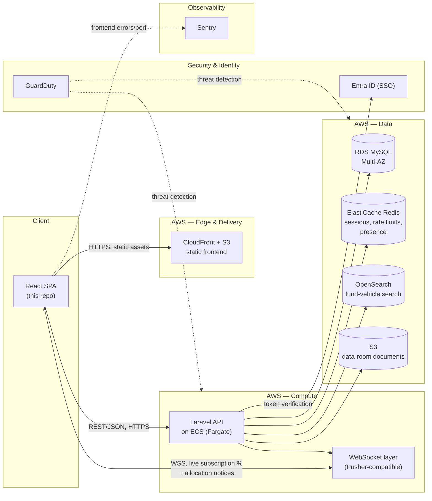

# System Architecture

Rendered, Greenstone-branded version: [`system-architecture.svg`](system-architecture.svg) (source of truth for the deck/PDF).

Production framing — the prototype (this repo) runs the frontend half of this standalone
against a mock API; everything right of the dashed line is the "how I'd build it for
Greenstone" answer, not code in this repo.

## Why these choices

- **ECS Fargate, not a monolith EC2 box.** Matches the JD's AWS surface directly (RDS,
  S3, ElastiCache, OpenSearch, GuardDuty all named explicitly) and keeps the API
  horizontally scalable ahead of a fundraise deadline spike (many LPs submitting near a
  fund's close date), without managing servers.
- **ElastiCache does three jobs, not one.** Session storage, rate-limiting the
  Indication-of-Interest endpoint (a required security control — see Technical Approach),
  and WebSocket presence/pub-sub backing — one managed service, three related
  responsibilities, rather than three separate pieces of infrastructure.
- **OpenSearch is scoped to fund-vehicle discovery only**, not a general-purpose search
  layer — the prototype's client-side filter is the honest v1 stand-in (see the deferred
  list in `proposal/concept.md`); OpenSearch is the documented upgrade path once listing
  volume outgrows client-side filtering.
- **GuardDuty wraps the whole AWS account**, not a specific service — it's a detection
  layer, not something the application calls.
